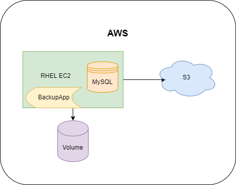
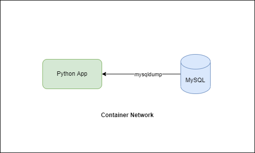

# mysqlbackup

## The Problem
A MySQL database is hosted in a RHEL EC2 in AWS. Business requires to conduct table-level backup whenever rollback required.

Previously the MySQL server was migrated from AWS RDS due to performance tuning, also RDS snapshot could not fullfill business requirements as most of the time, recovery is only required for specific tables.

## The Challenge
Heavy Batch data processing is performed in MySQL. The pipeline is an ELT process. Think of more than 10 mil records have their 95% transformations done in the server.
Resulting a dozens of tables with size more than 100 GB (Disk file size)

Business requires while backup is being performed, there is minimum impact on the operations.

Backup copies to be stored for more than 6 months before moving to archive.

## The Solution Framework


Use:
1. `mysqldump` to export all the routines, table definitions, functions
2. `mysqlbackup` to backup table data (Require MySQL Enterprise subscription)
3. Additional Volume mounted to temporarily store backup files (Adjusted Disk IOPS)
4. Use `boto3` to interact with AWS Volume and S3
## In This Code


Docker container is used to quickly spawn a MySQL server, with Chinook dataset loaded into schema *chinook*

A python container is launched within the same network using Dockerfile. This python app will use `mysqldump` to export table data from the MySQL Server
## To Run the Code

1. Ensure your Docker is running in your host
2. Run the docker-compose.yml file

    ```docker-compose up -d```
3. You should have 2 containers running: **mysql_test** and **python_app**
4. Go into **python_app** container by running
   
    ```docker exec -ti python_app bash```
5. Run the `main.py` inside the container
    
    ```python main/main.py```
6. You should be able to find the backup files created in this directory

    ```/mysqlbackup/chinook```

### Extra
To check Chinook tables in MySQL server, after you spawn your containers, run

```docker exec -ti mysql_test bash```

Log in to MySQL server using the provided credentials in the `docker-compose.yml`

```mysql -u test_user -ppassword```

And you now can query the table

e.g.

```
use chinook;
select * from album;
```
